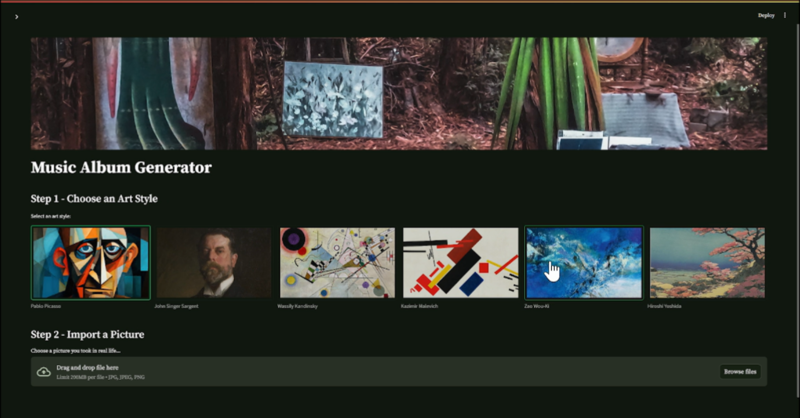

## AI-Generated Art and Music Platform

This project offers an interactive platform for creating AI-generated art and music, blending creativity with advanced technology. Users can select art styles from various historical periods and artists, upload personal plant images, and generate unique visual and auditory content. The platform allows for a highly personalized creative experience, making it easy to explore new possibilities in art and sound.

## Table of Contents

- [Demo Video](#demo-video)
- [Overview](#overview)
- [Setup Guide](#setup-guide)
- [Music Generation Flow](#music-generation-flow)

## Demo Video

)

## Overview

The platform emphasizes a personalized creative experience, encouraging exploration of new artistic and musical possibilities.

## Setup Guide

1. **Install ComfyUI**: Ensure that ComfyUI is installed on your system.
2. **Launch ComfyUI**: Open ComfyUI and click the sidebar at the bottom right. Select **Load** to choose the `workflow_api.json` file.
3. **Open Web UI Settings**: Confirm that the Open Web UI top bar API is set to `http://127.0.0.1:8188/`.
4. **Check Checkpoint Name**: Ensure the `ckpt_name` in the Load Checkpoint node matches the `ckpt_name` in the `workflow_api.json` file.
5. **Run Python**: Make sure you are running Python version 3.11.9.
6. **Change Directory**: Enter the command `cd streamlit_web_UI` to navigate to the appropriate directory.
7. **Install Requirements**: Run `pip install -r requirements.txt` to install the necessary packages.
8. **Start the Application**: Execute `python -m streamlit run UI.py` to start the application.

## Music Generation Flow

1. **Select Art Style**: Choose an art style from a variety of options inspired by different artists and periods, providing diverse influences for the generated content.
   
2. **Import Plant Image**: Upload a plant image taken in real life. Default images are also available in the `Music-Album-Generator/streamlit_web_UI/image_chosen` folder for easy selection.

3. **Enter Textual Descriptions**: Provide additional information such as your name, album name, or other descriptions. This information is stored in the Album Gallery for personalization.

4. **Wait for Processing**: Allow a brief moment for the system to process the data and generate the content.

5. **View & Hear the Generated Content**: Once processing is complete, you will be redirected to a new interface to view and listen to the generated content, including visual images and accompanying music.

6. **Album Gallery**: Access the Album Gallery to view content generated by yourself and other users, allowing exploration of previously created works and new artistic possibilities.